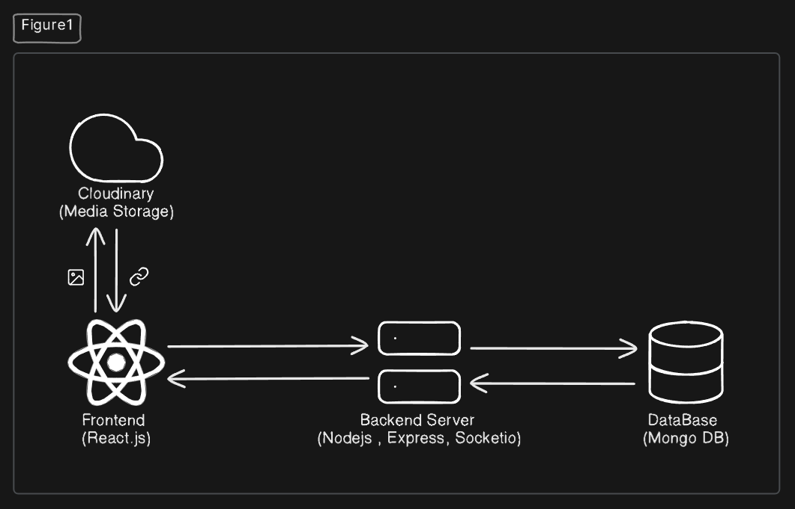

# Software Design Document (SDD): Visitor Management System

## 1. Introduction and Overview

### Purpose of the Software
The Visitor Management System (VMS) is a comprehensive digital solution designed to streamline and automate the visitor check-in/check-out process for organizations. It replaces traditional paper-based visitor logs with a modern, efficient system that enhances security, improves visitor experience, and provides better oversight for administrative staff.

### Scope and Objectives
- Digitize and automate the entire visitor management workflow
- Enable pre-registration and pre-approval of visitors
- Provide real-time notifications for hosts when visitors arrive
- Generate QR codes for streamlined check-in/check-out
- Collect and securely store visitor information
- Support multiple user roles with appropriate access controls

### Target Audience
- Organizations of all sizes requiring visitor management
- Receptionists and gate staff managing visitor entry/exit
- Hosts who receive visitors
- Administrative staff overseeing visitor policies
- Visitors themselves interacting with the check-in process

### Background or Problem Context
Traditional visitor management systems often involve paper logbooks, manual badge creation, and phone calls to notify hosts. This approach is inefficient, error-prone, and offers limited security. The VMS addresses these issues by providing a digital solution that enhances security, improves efficiency, and creates a professional impression for visitors.

## 2. System Architecture

### High-level Description
The VMS follows a modern client-server architecture with a React frontend and Node.js backend. It employs a RESTful API pattern for communication between client and server, with socket-based real-time notifications. The system is database-driven and uses Cloudinary for media storage.

### Architecture Diagram



### Technology Stack
- **Frontend**: React.js with Hooks, Tailwind CSS, Socket.IO client, React Router, Axios
- **Backend**: Node.js with Express.js, JWT authentication, Socket.IO
- **Database**: MongoDB with Mongoose ORM
- **Media Storage**: Cloudinary for photos and QR codes
- **Real-time Communication**: Socket.IO
- **Authentication**: JWT-based authentication and role-based access control

## 3. Data Design

### Database Schema
The system uses MongoDB with the following core collections:

1. **Visitors**
   - Basic information: fullname, email, contact, purpose, organisation, employeeId, photo
   - References: hostEmployee (Host), gate (Gate)
   - Status tracking: status (Approved, Declined, Waiting, Checked-in, Checked-out)
   - Timing information: checkIn, checkOut, expectedCheckInFrom, expectedCheckInTo
   - Badge information: badge.qrCode, badge.issuedAt
   - Flags: preApproved
   - Metadata: timestamps (createdAt, updatedAt)

2. **Hosts**
   - Basic information: name, department, employeeId, username, password, contact
   - References: visits, preApproved, visitRequestQueue (arrays of Visitor IDs)
   - Settings: preApprovalLimit
   - Methods: password hashing and comparison

3. **Gates**
   - Basic information: name, loginId, password
   - Methods: password hashing and comparison

4. **Admins**
   - Basic information: name, email, username, password
   - Role information: status (Admin, SuperAdmin)
   - Methods: password hashing and comparison

### Key Data Entities and Relationships

#### Visitor Schema
```javascript
const visitorSchema = new mongoose.Schema({
    fullname:{
        type:String,
        required:true,
    },
    email:{
        type:String,
    },
    contact:{
        type:String,
    },
    purpose:{
        type:String,
    },
    hostEmployee:{
        type: mongoose.Schema.Types.ObjectId,
        ref: 'Host' 
    },
    organisation:{
        type:String
    },
    employeeId:{
        type:String
    },
    photo:{
        type:String,
    },
    status: {
        type: String,
        enum: ['Approved', 'Declined', 'Waiting', 'Checked-in', 'Checked-out'],
        default: 'Waiting'
    },
    checkIn: {
        type: Date,
    },
    checkOut: {
        type: Date,
    },
    expectedCheckInFrom:{
        type: Date,
    },
    expectedCheckInTo:{
        type: Date,
    },
    preApproved:{
        type:Boolean,
        default:false
    },
    badge: {
        qrCode: {
          type: String, // base64 image or URL
        },
        issuedAt: {
          type: Date,
        }
    },
    gate: {
        type: mongoose.Schema.Types.ObjectId,
        ref: 'Gate',
    }
}, {
    timestamps: true
});
```

#### Host Schema
```javascript
const hostSchema = new mongoose.Schema({
    name:{
        type:String,
        required:true,
        unique:true
    },
    department:{
        type:String
    },
    employeeId:{
        type:String
    },
    username:{
        type:String,
        required:true,
        unique:true
    },
    password: {
        type: String,
        required: true,
        minlength: 6
    },
    contact:{
        type:String
    },
    visits: [{
        type: mongoose.Schema.Types.ObjectId,
        ref: 'Visitor' 
    }],
    preApproved:[{
        type: mongoose.Schema.Types.ObjectId,
        ref: 'Visitor' 
    }],
    preApprovalLimit: {
        type: Number,
        default: 10,
        required: true
    },
    visitRequestQueue:[{
        type: mongoose.Schema.Types.ObjectId,
        ref: 'Visitor' 
    }]
});
```

#### Gate Schema
```javascript
const gateSchema = new mongoose.Schema({
    name:{
        type:String,
        required:true,
        unique:true
    },
    loginId:{
        type:String,
        required:true,
        unique:true
    },
    password: {
        type: String,
        required: true,
        minlength: 6
    }
});
```

#### Admin Schema
```javascript
const adminSchema = new mongoose.Schema({
    status: {
        type: String,
        enum: ['Admin', 'SuperAdmin'], 
    },
    name:{
        type:String,
        required:true,
    },
    email:{
        type:String,
    },
    username:{
        type:String,
        required:true,
        unique:true
    },
    password: {
        type: String,
        required: true,
        minlength: 6
    }
});
```

#### Entity Relationships
1. **Hosts to Visitors**:
   - One-to-many relationship
   - A host can have multiple visitors (tracked in `visits` array)
   - A host can pre-approve multiple visitors (tracked in `preApproved` array)
   - A host can have multiple visitor requests waiting for approval (tracked in `visitRequestQueue` array)
   - Each visitor is assigned to exactly one host (referenced by `hostEmployee` field)

2. **Gate to Visitors**:
   - Many-to-many relationship
   - A gate staff can process many visitors
   - A visitor can be associated with a gate (referenced by `gate` field)

3. **Badge to Visitors**:
   - Embedded document relationship
   - Each visitor can have one badge with QR code
   - Badge information is embedded directly in the visitor document

4. **Visitor Status Workflow**:
   - Workflow managed via `status` field
   - Valid statuses: 'Approved', 'Declined', 'Waiting', 'Checked-in', 'Checked-out'
   - Pre-approved visitors can be marked with the `preApproved` flag
   - Check-in and check-out times are recorded in separate date fields

### Data Flow and Storage Strategies
1. **Visitor Registration Flow**:
   - Visitor data is captured via form or pre-approved by host
   - Data is stored in MongoDB
   - Photos and QR codes are stored as URLs, typically pointing to Cloudinary

2. **Access Control Strategy**:
   - Role-based segregation with separate models for Admin, Host, and Gate
   - Hosts can only access their own visitors via the relationship arrays
   - Gate staff can process all visitors but primarily focus on daily visitors
   - Admins have administrative capabilities based on their status

## 4. Interface Design

### API Design
The system exposes RESTful APIs organized by user roles:

1. **Authentication Endpoints**:
   Each user role has its own direct login endpoint:
   - `POST /api/admin/login`: Admin login
   - `POST /api/host/login`: Host login
   - `POST /api/gate/login`: Gate login

2. **Admin Endpoints**:
   - `POST /api/admin/add`: Add a new admin
   - `POST /api/admin/host/add`: Add a new host
   - `DELETE /api/admin/host/delete`: Delete a host
   - `GET /api/admin/hosts`: Get all hosts
   - `PUT /api/admin/setLimit`: Set pre-approval limit for an individual host
   - `PUT /api/admin/setLimitAll`: Set pre-approval limit for all hosts
   - `POST /api/admin/gate/add`: Add a new gate
   - `DELETE /api/admin/gate/delete`: Delete a gate
   - `GET /api/admin/gates`: Get all gates
   - `GET /api/admin/visitors`: Get all visitors

3. **Host Endpoints**:
   - `POST /api/host/visitor/add`: Add new pre-approved visitor
   - `GET /api/host/visitors`: Get all visitors for the host
   - `GET /api/host/preApproved`: Get pre-approved visitors
   - `GET /api/host/pendingReq`: Get pending approval requests
   - `PUT /api/host/approve`: Approve visitor
   - `PUT /api/host/decline`: Decline visitor
   - `POST /api/host/generate-qr`: Generate QR code for visitor

4. **Gate Endpoints**:
   - `POST /api/gate/addVisitor`: Register walk-in visitor
   - `POST /api/gate/requestApproval`: Request approval for walk-in visitor
   - `POST /api/gate/generateQR`: Generate QR code for approved visitor
   - `PUT /api/gate/checkin`: Check in visitor using QR code
   - `PUT /api/gate/checkout`: Check out visitor using QR code
   - `GET /api/gate/todaysVisitors`: Get today's visitors
   - `GET /api/gate/hosts`: Get all hosts

### External System Integrations
- **Cloudinary**: For storing visitor photos and QR code images
- **Socket.IO**: For real-time notifications and updates

### Communication Protocols
- **HTTP/HTTPS**: RESTful API communication
- **WebSockets**: Real-time updates and notifications via Socket.IO
- **JWT**: For secure authentication and authorization

## 5. Component Design

### Major Components

1. **Authentication Module**
   - Each user type (admin, host, gate) has its own login endpoint
   - JWT tokens are used for session management and authentication
   - Middleware-based authentication for protected routes
   - Role-based access control to restrict endpoint access
   - No token refresh mechanism; sessions expire based on JWT lifetime

2. **Admin Dashboard**
   - User management (create, read, update, delete)
   - System settings and configuration
   - Analytics and reporting

3. **Host Portal**
   - Visitor pre-approval workflow
   - Approval/decline of visitor requests
   - QR code and badge generation
   - Real-time notifications

4. **Gate Interface**
   - QR code scanning for check-in/check-out
   - Walk-in visitor registration
   - Badge printing
   - Visitor status management

5. **Visitor Processing System**
   - Registration and data collection
   - Status tracking throughout the visit lifecycle
   - QR code generation and validation

6. **Notification System**
   - Real-time socket-based communication
   - Alerts hosts of visitor arrivals
   - Updates gate staff of approval/decline actions

### Component Interactions
- The **Authentication Module** validates requests to all other components
- The **Host Portal** sends approval notifications to the **Notification System**
- The **Gate Interface** uses the **Visitor Processing System** for check-ins/outs
- The **Notification System** pushes updates to relevant users based on events

## 6. User Interface Design

### Key UI Screens

1. **Login Pages**
   - Separate login interfaces for admin, host, and gate staff
   - Username/password authentication with error handling

2. **Admin Dashboard**
   - User management interface with CRUD operations
   - Analytics displays with visitor statistics
   - System settings configuration

3. **Host Dashboard**
   - Pending approval requests section
   - Pre-approved visitors section
   - All visitors section with filtering options
   - Visitor detail modal with approval/decline actions
   - Add visitor form for pre-approvals
   - Badge generation interface

4. **Gate Dashboard**
   - Today's visitors display with status indicators
   - QR code scanner interface for check-in/check-out
   - Walk-in visitor registration form
   - Badge printing interface

5. **Visitor Badge**
   - Digital badge with visitor photo
   - QR code for check-out
   - Visit details (name, host, purpose, time)
   - Print-friendly format

### UX Considerations
- Real-time updates without page refresh using Socket.IO
- Mobile-responsive design for all interfaces
- Accessible color scheme and contrast
- Clear status indicators and feedback for actions
- Optimized printing for visitor badges
- Graceful error handling and user feedback

## 7. Assumptions and Dependencies

### Technical Assumptions
- Users have access to modern web browsers supporting ES6+ JavaScript
- Reliable internet connectivity for cloud-based operations
- Sufficient server resources to handle concurrent users
- HTTPS protocol for secure data transmission
- MongoDB as the primary database

### Dependencies
- **Node.js**: Server-side runtime environment
- **MongoDB**: Database system
- **Cloudinary**: Cloud-based media storage
- **Socket.IO**: Real-time communication
- **JWT**: Authentication mechanism
- **Axios**: HTTP client for API requests
- **React.js**: Frontend framework
- **Tailwind CSS**: Styling framework
- **QR code libraries**: For generating and scanning QR codes
- **PDF generation libraries**: For saving visitor badges

### Environmental Requirements
- Development, staging, and production environments
- Environment variables for configuration
- MongoDB instance (local or Atlas)
- Cloudinary account with proper configuration 
